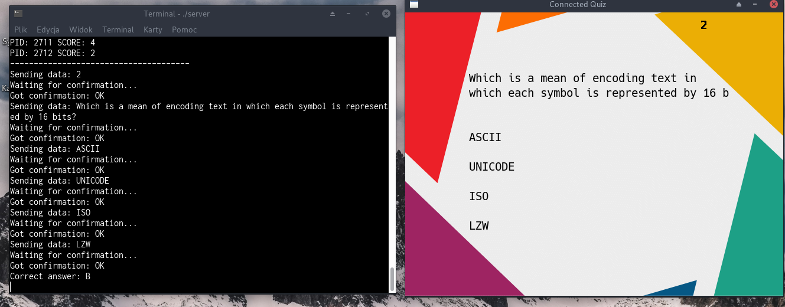

EN
--

### Project subject matter

Subject matter of this project was implementation of quiz, which work is based on the network - all the mechanics are implemented on the server, where questions are loaded from categories, randomly choosen and sent to the client, which only job is to print them and send choosen answer back to the server. Server then valides the answer and resends a point based on the corectness of the answer. It allows a maximum of 20 connections at one time. 

### Used programming language, libraries, IDE, OS

Program was written especially for the GNu/Linux system on account of the networking libraries. Code was written in Atom editor, next compiled using gcc compilator. 

### Instructions of compilation, running, how it works

Necessay libraries are SDL and SDL_ttf libraries. 

* Compilation is based on the Makefile.

`make all` - compile whole project
`make server` - compile only server part
`make client` - compile only client part

* Running

`./server` - start the server - which works by listening all the time for new connections. In this moment the only way to exit is CTRL-C combination.

`./client` - start the client which tries to connect to server. 

* Running the program is very easy, server while running is only used for printing information what is actually doing or errors. As for client, it's only neccessary to click on the answers in order to send them to server. 

### Screen of the working program. 

### Short summary, plans for the future, etc

Server part is using various mechanisms such as forking the process. It's essential for allowing multiple number of connections at the same time, not having to wait for freeing the socket. Structure of processes is looking like this - `child` process are handling the client while `parent` is working on the scoreboard, which is possible by communcation between processes used with `pipe()`. 

Unfortunately, it was not possible to implement clean exit from server, which would free the dunamic questions array. It's connected with plans to imlpement the interface using the `ncurses` library, as well as grouping the messages in various windows in the terminal. 

Additional plan would be to implement better solution to multiple client connections, as for now server is using huge amount of resources if run longer. Good way would be to use `polling` mechanism, which would prevent unneccessary creation of new processes. 

PL
--

### Opis tematyki projektu

Tematem projektu była implementacja quizu którego działanie opiera się na sieci - mechanika działa na serwerze gdzie ładowane są pytania z kategorii, losowane i wysyłane do klienta którego jedynym zadaniem jest wypisanie pytań razem z odpowiedziami na ekranie i wysłanie gotowej odpowiedzi do serwera, który waliduje odpowiedź i przesyła punkt w zależności od poprawności odpowiedzi. Umożliwia jednoczesne podłączenie maksymalnie 20 klientów. 

### Użyty język programowania, biblioteki, IDE, OS

Program został napisany specjalnie pod urzędzania z systemem GNU/Linux ze względu na unikatowość funkcji operujących na sieci. Kod był pisany w edytorze Atom, następnie kompilowany przy użyciu kompilatora gcc.

### Instrukcja kompilacji, uruchomienia, opis działania, instrukcja obsługi

Wymagania do kompilacji to biblioteka SDL oraz SDL_ttf. 
* Kompilacja odbywa się za pomocą Makefile
make all - skompilowanie całego projektu
make server - osobna kompilacja serwera
make client - osobna kompilacja klienta

* Uruchomienie programu.
./server - uruchomienie serwera - klient działa nasłuchując cały czas nowych połączeń. W tej chwili jedyny sposób na wyłączenie klienta to kombinacja CTRL-C
./client - uruchomienie klienta który próbuje połączyć się z serwerem. 

* Działanie programu jest bardzo proste, serwer w trakcie działania jedynie wypisuje aktualne powiadomienia o wykonywanych czynnościach lub błędach. 
Jako klient należy jedynie klikać w odpowiednie pola z odpowiedziami w celu przesłania odpowiedzi do serwera. 

### Zrzuty ekranu z przykładowym działaniem

## Krótkie podsumowanie, czego nie udało się zrealizować, mozliwe kierunki rozwoju

Program serwera wykorzystuje różne mechanizmy takie jak forkowanie procesu. Potrzebne jest to aby każdy klient mógł operować równocześnie nie czekając na zwolnienie socketu. Struktura procesów wygląda następująco - procesy `dzieci` obsługują klientów natomiast proces rodzic zajmuje się obsługą tablicy wyników, która jest możliwa dzięki rozmiowie procesów przy użyciu pipe(). 

Niestety nie udało się zrealizować wyjścia z serwera które jednocześnie obsługiwało by czyszczenie dynamicznej tablicy pytań. Jest to połączone z planami na przyszłośćm czyli stworzeniem interfejsu serwera w ncurses, które pozwoliło by na wyczyszczenie zasobów przed wyjściem, jak i na pogrupowanie wyświetlanych komunikatów w odpowiednie okna w terminalu.

Dodatkowym planem byłoby polepszenie mechanizmu obsługi wielu klientów, obecnie serwer nie jest skalowalny i zużywa ogromną ilość zasobów przy długotrwałym działaniu. Dobrym rozwiązaniem byłoby użycie mechanizmu `polling`, które zapobiegło by bezpotrzebnemu tworzeniu i kopiowaniu uzytych procesów.